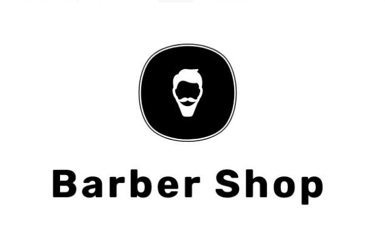

<h1 align="center">Barber Shop</h1>

Barber Shop é um template para barbearias, criado com React

## Tecnologias usadas :rocket:

- [React](https://pt-br.reactjs.org/) é uma biblioteca JavaScript de código aberto com foco em criar interfaces de usuário em páginas web.
- [React Icons](https://react-icons.github.io/react-icons/) biblioteca com vários ícones para usar.
- [React Router](https://reactrouter.com/) é uma biblioteca para uso de rotas dinâmicas dentro da sua aplicação.
- [Sass](https://sass-lang.com/) é um preprocessador CSS.

## Como executar :hammer:

Você precisará ter o [NodeJS](https://nodejs.org/en/) na sua máquina.

1. Clone este repositório.
2. Abra uma nova janela no terminal e navegue até o diretório do projeto.
3. Execute `npm install` ou `yarn`.
4. Execute `npm start` ou `yarn start`.

Para gerar um build do projeto, utilize o comando `npm run build` ou `yarn build`.

<h2>Imagens :sparkles:</h2>

